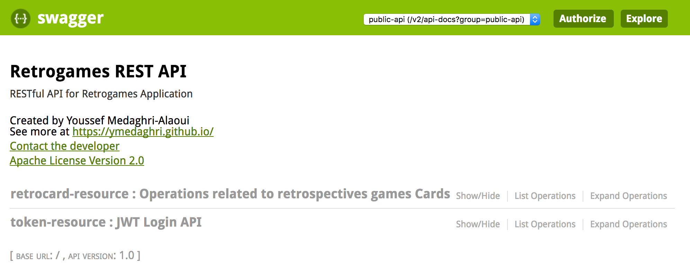

# jwt
Spring Boot, Rest Api's Swagger and JWT libraries authentication 

### Description
This is a Spring Boot Project Using Rest Api's, Swagger and JWT Authentication
This project uses gradle configuration.

### How does it work
You can build and execute using the provided gradle library, and the launch the Spring Boot Jar using Java command line.
```
./gradlew build
java -jar build/libs/jwt-0.0.1-SNAPSHOT.jar
```

### Swagger
Swagger is accessible via its default url : http://localhost:8080/swagger-ui.html

* Available API's
  * retrocard-resource : Operations related to retrospectives games Cards
  * token-resource : JWT Login API



## Questions

Having a problem getting something to work or want to know more ? Ping me on Twitter [@ymedaghri](https://twitter.com/ymedaghri) or file a [GitHub Issue](https://github.com/ymedaghri/jwt/issues/new).
